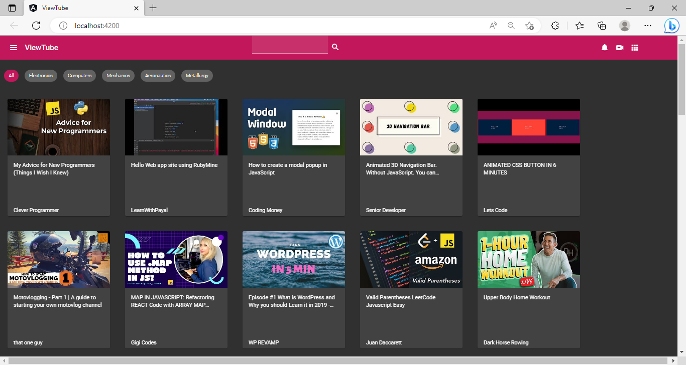
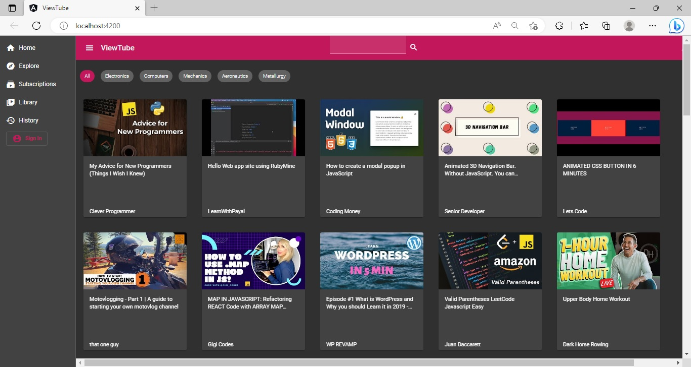

## Practice - Style an Angular Application using Angular Material

### Points to Remember

- The Angular Material components should only be used for styling the application.
- The Angular Material component selectors should not be used to define the CSS style properties. 
    - Instead, define `id` or `class` attributes on the elements and use them as CSS selectors to define the style rules.

### Instructions for Practice

- Fork the boilerplate into your own workspace. ​​​
- Clone the boilerplate into your local system. ​​​
- Open command terminal and set the path to the folder containing the cloned boilerplate code.​​​
- Run the command `npm install` to install the dependencies.​
- Open the folder containing the boilerplate code in `VS Code`.​​
- Style the `ViewTube` application and generate the output as shown in the `view-tube-expected-output.jpg` file. This file is located inside the `resources` folder.

Notes:​
1. The solution of this practice will undergo an automated evaluation on the `CodeReview` platform. (Local testing is recommended prior to the testing on the `CodeReview` platform)​
2. The test cases are available in the boilerplate.​

### Context

The application `ViewTube` is a single-page application that allows users to view a list of videos.

This application has been designed using Angular and is styled using CSS properties.

As an Angular front-end developer, you are required to style the `ViewTube` application using the Angular Material components and themes.

#### About the Partial Code and Data File
- The boilerplate contains the code for the `ViewTube` application.
    - This code is fully functional and has the required components created with minimal style effects that are produced using the CSS style properties.
- The list of videos used in the application is defined in the `.ts` file for Angular service named `VideoService`. The file is located inside the `services` folder of the `app` folder.
    - The code in the `.ts` files should not be modified.
- Run the application before proceeding with the tasks to view the current output.
    - The image of the output of the given code is shown below:

### Problem Statement

Transform the design of the existing `ViewTube` application for a rich user experience, using the Angular Material components and themes.

​Note: The tasks to develop the solution are given below:

##### Expected Output (Sidebar Closed)

##### Expected Output (Sidebar Opened)

### Test the Solution Locally​
Test the solution first locally and then on the `CodeReview` platform. Steps to test the code locally are:
- From the command line terminal, set the path to the folder containing cloned boilerplate code.
- Run the command `ng test` or `npm run test` to test the solution locally and ensure all the test cases pass.
- Refactor the solution code if the test cases are failing and do a re-run.​
- Finally, push the solution to git for automated testing on the CodeReview platform.
